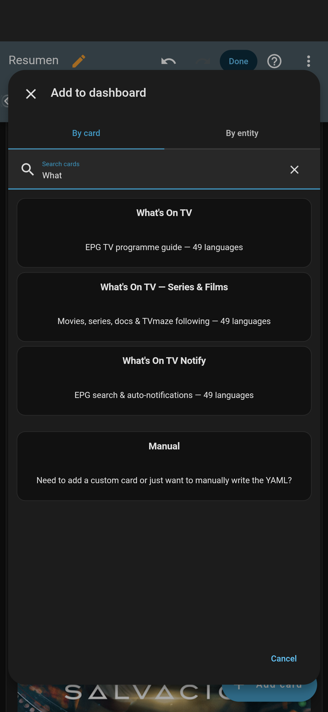
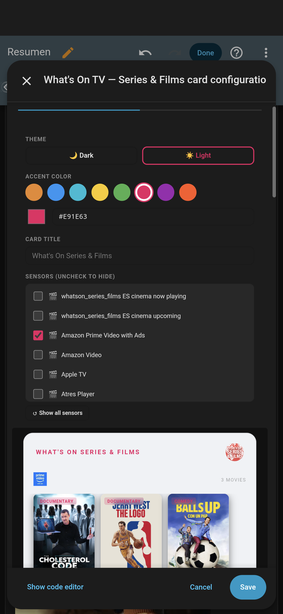
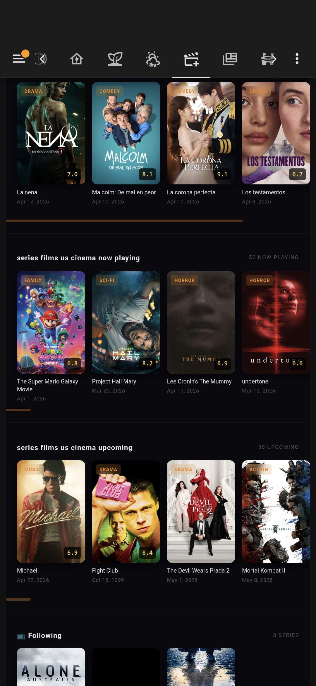
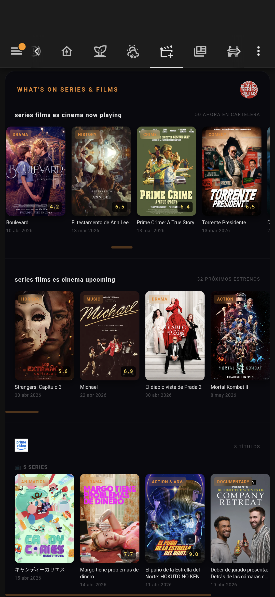
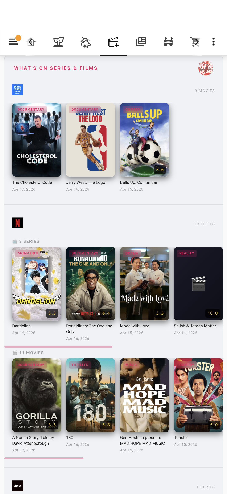
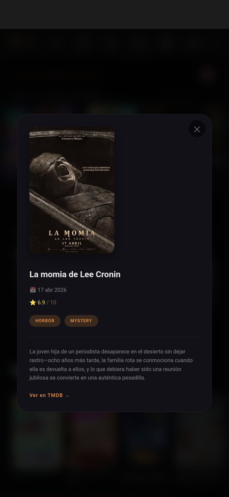
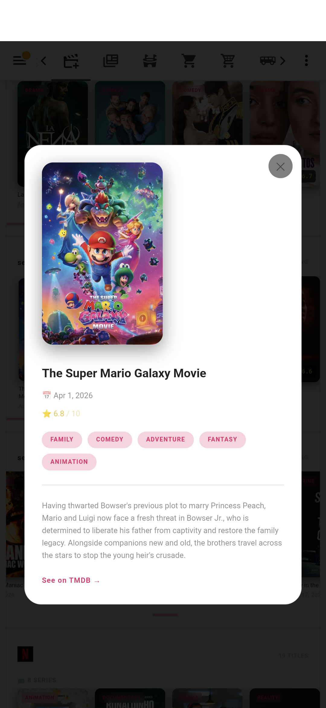
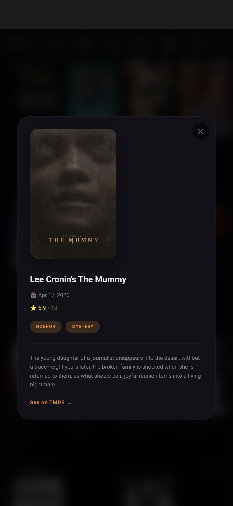

<div align="center">

# What's On Series & Films Card
## Stream and Cinema Guide <br> Home Assistant Lovelace Card

..........   


[](https://www.buymeacoffee.com/janfajessen)
[](https://www.patreon.com/janfajessen)
<!--[](https://ko-fi.com/janfajessen)
[](https://github.com/sponsors/janfajessen)


[](https://paypal.me/janfajessen)-->


Qué hacen en streaming y en el cine - ما الذي يعرض في البث المباشر والسينما - Nə var streaming və kinoda - Što rade na streaming-u i u kinu - Какво правят в стрийминг и кино - Što rade na streaming-u i u kinu - Què fan en streaming i al cinema - Co dělají na streamování a v kině - Hvad laver de på streaming og i biografen - Was machen sie beim Streaming und im Kino - Τι κάνουν στο streaming και στον κινηματογράφο - Qué hacen en streaming y en el cine - Quoi qu'ils font en streaming et au cinéma - Que fan en streaming e no cine - מה הם עושים בסטרימינג ובקולנוע - स्ट्रीमिंग और सिनेमा में क्या करते हैं - Mit csinálnak a streamingben és a moziban - Zer egiten dute streaming-ean eta zinean - در استریم و سینما چه کار می‌کنند - Mitä he tekevät suoratoistossa ja elokuvissa - Apa yang mereka lakukan di streaming dan bioskop - Cosa fanno in streaming e al cinema - Что делают в стриминге и кино - Co robią w streamingu i kinie - O que eles fazem no streaming e no cinema - Ce fac în streaming și la cinema - Що роблять у стрімінгу та кіно - Vad gör de på streaming och bio - Dizilerde ve filmlerde ne yapıyorlar - 流媒体和电影院在放什么

</div>

---

A Lovelace card for the [What's On Series & Films](https://github.com/janfajessen/What-s-On-Series-Films---Stream-Cinema-Guide---Home-Assistant) Home Assistant integration. Shows movies in theaters, new releases on streaming platforms, and tracks your followed TV series via TVmaze — all in one beautiful scrollable card.

<div align="center">

<picture>
  <source media="(min-width: 768px)" srcset="Screenshots/Screenshot_+add_card_select.png">
  
</picture>
<picture>
  <source media="(min-width: 768px)" srcset="Screenshots/Screenshot_configuration_light_card.png">
  
</picture>
<picture>
  <source media="(min-width: 768px)" srcset="Screenshots/Screenshot_cinemas_following_series.png">
  
</picture>
<picture>
  <source media="(min-width: 768px)" srcset="Screenshots/Screenshot_cines_en_españa_prime_video.png">
  
</picture>
<picture>
  <source media="(min-width: 768px)" srcset="Screenshots/Screenshot_light_card_prime_netflix_appletv.png">
  
</picture>
<picture>
  <source media="(min-width: 768px)" srcset="Screenshots/Screenshot_La_momia_sinopsis.png">
  
</picture>
<picture>
  <source media="(min-width: 768px)" srcset="Screenshots/Screenshot_light_mode_movie_information.png">
  
</picture>
<picture>
  <source media="(min-width: 768px)" srcset="Screenshots/Screenshot_modal_window_synopsi.png">
  
</picture>

</div>

---

## ✨ Features

- 🎬 **Cinema** — Now playing & upcoming releases in your country
- 📡 **Streaming platforms** — New movies, series/docs and top 50 grouped by platform (Netflix, Amazon, Disney+, etc.)
- 📺 **TVmaze Following** — Track your series with poster, channel, rating, last/next episode
- 🔥 **Global Trending** — Weekly top movies and series worldwide (dedicated tab)
- 🌍 **49 languages** — Auto-detects your HA language, including genre names
- 🎨 **Fully customizable** — Dark/light theme, 8 accent color presets + custom HEX/RGB
- ⚙️ **Visual editor** — Drag to reorder platforms, ✕ to hide, ↺ to restore
- 🖱️ **Smooth horizontal scroll** — Mouse wheel, click-and-drag, and touch support
- 💡 **Auto-discovery** — Finds all `sensor.whatson_*` sensors automatically

---

## 📦 Installation

### Via HACS (recommended)

1. Open HACS → Frontend → **+ Explore & Download Repositories**
2. Search for **What's On TV Series & Films Card**
3. Download and restart HA

### Manual

1. Copy `whatson-series-films-card.js` to `/config/www/`
2. Go to **Settings → Dashboards → Resources**
3. Add `/local/whatson-series-films-card.js?v=1` as **JavaScript Module**

> **Tip:** When updating the card, increment the `?v=` number (e.g. `?v=2`) to force the browser to reload the new version and clear cache.

---

## 🚀 Usage

### Minimal (auto-discover everything)

```yaml
type: custom:whatson-series-films-card
```

### With options

```yaml
type: custom:whatson-series-films-card
title: "What's On"
theme: dark        # dark | light
accent: "#e8872a"  # any hex color
```

### Specific sensors only

```yaml
type: custom:whatson-series-films-card
entities:
  - sensor.whatson_series_films_es_cinema_now_playing
  - sensor.whatson_series_films_es_new_movies_on_netflix_standard_with_ads
  - sensor.whatson_series_films_lupin_status
```

---

## ⚙️ Configuration options

| Option | Type | Default | Description |
|--------|------|---------|-------------|
| `title` | string | *(auto from HA language)* | Card title |
| `theme` | `dark`\|`light` | `dark` | Color theme |
| `accent` | string | `#e8872a` | Accent color (HEX or `R,G,B`) |
| `entities` | list | *(auto-discover)* | Specific sensors to display |
| `platform_order` | list | `[]` | Platform display order (set via visual editor drag) |
| `hidden_entities` | list | `[]` | Hidden platforms/sensors (set via visual editor ✕) |

---

## 🔧 Automations & Scripts

### Notify when a new movie appears in theaters

```yaml
alias: "What's On — New cinema release"
trigger:
  - platform: template
    value_template: >
      {{ state_attr('sensor.whatson_series_films_es_cinema_now_playing', 'movies')
         | selectattr('release_date', 'ge', now().strftime('%Y-%m-%d'))
         | list | count > 0 }}
action:
  - action: notify.telegram_jan
    data:
      message: >
        🎬 New in theaters today:
        {% for m in state_attr('sensor.whatson_series_films_es_cinema_now_playing', 'movies')
           if m.release_date == now().strftime('%Y-%m-%d') %}
        • {{ m.title }} (⭐{{ m.vote_average }})
        
```

### Notify when a followed series has a new episode

```yaml
alias: "What's On — New episode available"
trigger:
  - platform: state
    entity_id: sensor.whatson_series_films_lupin_next_episode
    from: "No upcoming episode"
action:
  - action: notify.telegram_jan
    data:
      message: >
        📺 New episode of **Lupin**!
        {{ states('sensor.whatson_series_films_lupin_next_episode') }}
```

### Send weekly streaming highlights to Telegram

```yaml
alias: "What's On — Weekly highlights"
trigger:
  - platform: time
    at: "09:00:00"
  - platform: template
    value_template: "{{ now().weekday() == 4 }}"  # Friday
action:
  - variables:
      movies: "{{ state_attr('sensor.whatson_series_films_es_new_movies_on_netflix_standard_with_ads', 'movies') }}"
  - action: notify.telegram_jan
    data:
      message: >
        🎬 *New on Netflix this week:*
        
        • {{ m.title }} ⭐{{ m.vote_average }}
        
```

### Display now-playing count as a sensor badge

```yaml
template:
  - sensor:
      - name: "Cinema now playing count"
        state: >
          {{ state_attr('sensor.whatson_series_films_es_cinema_now_playing', 'movies') | count }}
        icon: mdi:ticket-confirmation-outline
```

---

## 🗺️ Available countries

### 🎬 Cinema (TMDB Now Playing / Upcoming)

|  |  |  |  |  |
|--|--|--|--|--|
| 🇪🇸 España / Espanya / Espainia | 🇦🇩 Andorra | 🇦🇱 Shqipëria \* | 🇦🇷 Argentina | 🇦🇲 Հայաստան \* |
| 🇦🇺 Australia | 🇦🇹 Österreich | 🇦🇼 Aruba \* | 🇸🇦 المملكة العربية السعودية | 🇧🇾 Беларусь \* |
| 🇧🇪 België / Belgique / Belgien | 🇧🇴 Bolivia \* | 🇧🇦 Bosna i Hercegovina / Босна и Херцеговина \* | 🇧🇷 Brasil | 🇧🇬 България \* |
| 🇨🇦 Canada | 🏝️ Caribbean \* | 🇨🇱 Chile | 🇨🇳 中国 \* | 🇨🇴 Colombia |
| 🇨🇷 Costa Rica \* | 🇨🇮 Côte d'Ivoire \* | 🇭🇷 Hrvatska \* | 🇨🇿 Česká republika | 🇨🇾 Κύπρος / Kıbrıs \* |
| 🇩🇰 Danmark | 🇩🇴 Rep. Dominicana \* | 🇪🇨 Ecuador \* | 🇪🇬 مصر \* | 🇸🇻 El Salvador \* |
| 🇪🇪 Eesti \* | 🇫🇴 Færøerne / Føroyar \* | 🇫🇮 Suomi / Finland | 🇫🇷 France | 🇬🇪 საქართველო \* |
| 🇩🇪 Deutschland | 🇬🇭 Ghana \* | 🇬🇷 Ελλάδα | 🇬🇹 Guatemala \* | 🇭🇳 Honduras \* |
| 🇭🇰 Hong Kong / 香港 | 🇭🇺 Magyarország | 🇮🇪 Ireland / Éire | 🇮🇸 Ísland \* | 🇮🇳 Bharat भारत |
| 🇮🇩 Indonesia | 🇮🇱 יִשְׂרָאֵל | 🇮🇹 Italia | 🇯🇲 Jamaica \* | 🇯🇵 日本 |
| 🇰🇿 Қазақстан \* | 🇰🇪 Kenya \* | 🇱🇻 Latvija \* | 🇱🇧 لبنان \* | 🇱🇮 Liechtenstein \* |
| 🇱🇾 Libya / ليبيا \* | 🇱🇹 Lietuva \* | 🇱🇺 Lëtzebuerg / Luxembourg / Luxemburg \* | 🇲🇴 Macao / 澳門 \* | 🇲🇬 Madagasikara \* |
| 🇲🇼 Malawi \* | 🇲🇾 Bahasa Melayu \* | 🇲🇹 Malta \* | 🇲🇺 Mauritius \* | 🇲🇽 México |
| 🇲🇰 Северна Македонија \* | 🇲🇳 Монгол \* | 🇲🇪 Crna Gora / Crna Гора \* | 🇲🇦 المغرب \* | 🇲🇨 Monaco / Mónegue \* |
| 🇲🇿 Moçambique \* | 🇳🇦 Namibia \* | 🇳🇱 Nederland | 🇳🇨 Nouvelle-Calédonie \* | 🇳🇿 New Zealand / Aotearoa |
| 🇳🇮 Nicaragua \* | 🇳🇬 Nigeria \* | 🇳🇴 Norge / Noreg | 🇵🇰 Pakistan \* | 🇵🇦 Panamá \* |
| 🇵🇾 Paraguay \* | 🇵🇪 Perú \* | 🇵🇭 Pilipinas \* | 🇵🇱 Polska | 🇵🇸 فلسطين \* |
| 🇵🇹 Portugal | 🇵🇷 Puerto Rico \* | 🇶🇦 قطر \* | 🇷🇴 România | 🇷🇺 Россия |
| 🇷🇸 Srbija / Србија \* | 🇸🇲 San Marino \* | 🏴󠁧󠁢󠁳󠁣󠁴󠁿 Scotland \* | 🇸🇬 Singapore / 新加坡 / சிங்கப்பூர் / Singapura | 🇸🇰 Slovensko \* |
| 🇸🇮 Slovenija \* | 🇿🇦 South Africa \* | 🇰🇷 대한민국 | 🇸🇪 Sverige | 🇨🇭 Schweiz / Suisse / Svizzera / Svizra |
| 🇹🇼 Taiwan / 臺灣 | 🇹🇭 ประเทศไทย | 🇹🇷 Türkiye | 🇺🇬 Uganda \* | 🇺🇦 Украïна \* |
| 🇦🇪 Al-Imarat \* | 🇬🇧 United Kingdom / Cymru / Alba | 🇺🇸 United States | 🇺🇾 Uruguay \* | 🇺🇿 Oʻzbekiston \* |
| 🇻🇦 Città del Vaticano \* | 🇻🇪 Venezuela | 🇻🇳 Việt Nam \* | 🇿🇲 Zambia \* | 🇿🇼 Zimbabwe \* |

\* Cinema data may be limited or unavailable for this country — worldwide streaming platforms remain fully available regardless.

### 📡 Streaming platforms availability

Availability varies by country. The most common platforms supported:

| Platform | Main countries |
|----------|---------------|
| Netflix | 🌍 Worldwide (190+ countries) |
| Amazon Prime Video | 🌍 Worldwide (200+ countries) |
| Disney+ | 🇺🇸🇬🇧🇪🇸🇫🇷🇩🇪🇮🇹🇦🇺🇨🇦🇯🇵 + more |
| HBO Max / Max | 🇺🇸🇬🇧🇪🇸🇵🇹🇳🇱🇸🇪🇩🇰🇳🇴🇫🇮 + more |
| Apple TV+ | 🌍 Worldwide |
| Hulu | 🇺🇸 |
| Peacock | 🇺🇸 |
| Paramount+ | 🇺🇸🇬🇧🇪🇸🇫🇷🇩🇪🇮🇹🇦🇺🇨🇦 + more |
| Movistar+ | 🇪🇸 |
| 3Cat | 🇪🇸 <sub>(Catalunya)</sub> |
| RTVE Play | 🇪🇸 |
| Atresplayer | 🇪🇸 |

---

## 📋 Requirements

- Home Assistant 2024.1+
- [What's On Series & Films](https://github.com/janfajessen/What-s-On-Series-Films---Stream-Cinema-Guide---Home-Assistant) integration installed
- TMDB API key (free at [themoviedb.org](https://www.themoviedb.org/settings/api))
- TVmaze account (free, optional — for series tracking)

---

## 🤝 Related cards

- [What's On TV EPG Card](https://github.com/janfajessen/What-s-On-TV-EPG-TV-Guide-Card) — Full TV guide / EPG
- [What's On TV Notify Card](https://github.com/janfajessen/What-s-On-TV-Search-and-Notify-Card) — Search & notifications

---

## 📄 License

MIT License — © janfajessen

<!---

## ✨ Features

- 🎬 **Cinema** — Now playing & upcoming releases in your country
- 📡 **Streaming platforms** — New movies and series/docs grouped by platform (Netflix, Amazon, Disney+, etc.)
- 📺 **TVmaze Following** — Track your series with poster, channel, rating, last/next episode
- 🌍 **49 languages** — Auto-detects your HA language
- 🎨 **Fully customizable** — Dark/light theme, 8 accent color presets + custom HEX/RGB
- ⚙️ **Visual editor** — Add/remove specific sensors, no YAML needed
- 🖱️ **Smooth horizontal scroll** — Mouse wheel, click-and-drag, and touch support
- 💡 **Auto-discovery** — Finds all `sensor.whatson_*` sensors automatically

---

## 📦 Installation

### Via HACS (recommended)

1. Open HACS → Frontend → **+ Explore & Download Repositories**
2. Search for **What's On TV Series & Films Card**
3. Download and restart HA

### Manual

1. Copy `whatson-series-films-card.js` to `/config/www/`
2. Go to **Settings → Dashboards → Resources**
3. Add `/local/whatson-series-films-card.js?v=1` as **JavaScript Module**

> **Tip:** When updating the card, increment the `?v=` number (e.g. `?v=2`) to force the browser to reload the new version.

---

## 🚀 Usage

### Minimal (auto-discover everything)

```yaml
type: custom:whatson-series-films-card
```

### With options

```yaml
type: custom:whatson-series-films-card
title: "What's On"
theme: dark        # dark | light
accent: "#e8872a"  # any hex color
```

### Specific sensors only

```yaml
type: custom:whatson-series-films-card
entities:
  - sensor.whatson_series_films_es_cinema_now_playing
  - sensor.whatson_series_films_es_new_movies_on_netflix_standard_with_ads
  - sensor.whatson_series_films_lupin_status
```

---

## ⚙️ Configuration options

| Option | Type | Default | Description |
|--------|------|---------|-------------|
| `title` | string | *(auto from HA language)* | Card title |
| `theme` | `dark`\|`light` | `dark` | Color theme |
| `accent` | string | `#e8872a` | Accent color (HEX or `R,G,B`) |
| `entities` | list | *(auto-discover)* | Specific sensors to display |

---

## 🔧 Automations & Scripts

### Notify when a new movie appears in theaters

```yaml
alias: "What's On — New cinema release"
trigger:
  - platform: template
    value_template: >
      {{ state_attr('sensor.whatson_series_films_es_cinema_now_playing', 'movies')
         | selectattr('release_date', 'ge', now().strftime('%Y-%m-%d'))
         | list | count > 0 }}
action:
  - action: notify.telegram_jan
    data:
      message: >
        🎬 New in theaters today:
        {% for m in state_attr('sensor.whatson_series_films_es_cinema_now_playing', 'movies')
           if m.release_date == now().strftime('%Y-%m-%d') %}
        • {{ m.title }} (⭐{{ m.vote_average }})
        
```

### Notify when a followed series has a new episode

```yaml
alias: "What's On — New episode available"
trigger:
  - platform: state
    entity_id: sensor.whatson_series_films_lupin_next_episode
    from: "No upcoming episode"
action:
  - action: notify.telegram_jan
    data:
      message: >
        📺 New episode of **Lupin**!
        {{ states('sensor.whatson_series_films_lupin_next_episode') }}
```

### Send weekly streaming highlights to Telegram

```yaml
alias: "What's On — Weekly highlights"
trigger:
  - platform: time
    at: "09:00:00"
  - platform: template
    value_template: "{{ now().weekday() == 4 }}"  # Friday
action:
  - variables:
      movies: "{{ state_attr('sensor.whatson_series_films_es_new_movies_on_netflix_standard_with_ads', 'movies') }}"
  - action: notify.telegram_jan
    data:
      message: >
        🎬 *New on Netflix this week:*
        
        • {{ m.title }} ⭐{{ m.vote_average }}
        
```

### Display now-playing count as a sensor badge

```yaml
template:
  - sensor:
      - name: "Cinema now playing count"
        state: >
          {{ state_attr('sensor.whatson_series_films_es_cinema_now_playing', 'movies') | count }}
        icon: mdi:ticket-confirmation-outline
```

---

## 🗺️ Available countries

### 🎬 Cinema (TMDB Now Playing / Upcoming)

|  |  |  |  |  |
|--|--|--|--|--|
| 🇪🇸 España / Espanya / Espainia | 🇦🇩 Andorra | 🇦🇱 Shqipëria \* | 🇦🇷 Argentina | 🇦🇲 Հայաստան \* |
| 🇦🇺 Australia | 🇦🇹 Österreich | 🇦🇼 Aruba \* | 🇸🇦 المملكة العربية السعودية | 🇧🇾 Беларусь \* |
| 🇧🇪 België / Belgique / Belgien | 🇧🇴 Bolivia \* | 🇧🇦 Bosna i Hercegovina / Босна и Херцеговина \* | 🇧🇷 Brasil | 🇧🇬 България \* |
| 🇨🇦 Canada | 🏝️ Caribbean \* | 🇨🇱 Chile | 🇨🇳 中国 \* | 🇨🇴 Colombia |
| 🇨🇷 Costa Rica \* | 🇨🇮 Côte d'Ivoire \* | 🇭🇷 Hrvatska \* | 🇨🇿 Česká republika | 🇨🇾 Κύπρος / Kıbrıs \* |
| 🇩🇰 Danmark | 🇩🇴 Rep. Dominicana \* | 🇪🇨 Ecuador \* | 🇪🇬 مصر \* | 🇸🇻 El Salvador \* |
| 🇪🇪 Eesti \* | 🇫🇴 Færøerne / Føroyar \* | 🇫🇮 Suomi / Finland | 🇫🇷 France | 🇬🇪 საქართველო \* |
| 🇩🇪 Deutschland | 🇬🇭 Ghana \* | 🇬🇷 Ελλάδα | 🇬🇹 Guatemala \* | 🇭🇳 Honduras \* |
| 🇭🇰 Hong Kong / 香港 | 🇭🇺 Magyarország | 🇮🇪 Ireland / Éire | 🇮🇸 Ísland \* | 🇮🇳 Bharat भारत |
| 🇮🇩 Indonesia | 🇮🇱 יִשְׂרָאֵל | 🇮🇹 Italia | 🇯🇲 Jamaica \* | 🇯🇵 日本 |
| 🇰🇿 Қазақстан \* | 🇰🇪 Kenya \* | 🇱🇻 Latvija \* | 🇱🇧 لبنان \* | 🇱🇮 Liechtenstein \* |
| 🇱🇾 Libya / ليبيا \* | 🇱🇹 Lietuva \* | 🇱🇺 Lëtzebuerg / Luxembourg / Luxemburg \* | 🇲🇴 Macao / 澳門 \* | 🇲🇬 Madagasikara \* |
| 🇲🇼 Malawi \* | 🇲🇾 Bahasa Melayu \* | 🇲🇹 Malta \* | 🇲🇺 Mauritius \* | 🇲🇽 México |
| 🇲🇰 Северна Македонија \* | 🇲🇳 Монгол \* | 🇲🇪 Crna Gora / Crna Гора \* | 🇲🇦 المغرب \* | 🇲🇨 Monaco / Mónegue \* |
| 🇲🇿 Moçambique \* | 🇳🇦 Namibia \* | 🇳🇱 Nederland | 🇳🇨 Nouvelle-Calédonie \* | 🇳🇿 New Zealand / Aotearoa |
| 🇳🇮 Nicaragua \* | 🇳🇬 Nigeria \* | 🇳🇴 Norge / Noreg | 🇵🇰 Pakistan \* | 🇵🇦 Panamá \* |
| 🇵🇾 Paraguay \* | 🇵🇪 Perú \* | 🇵🇭 Pilipinas \* | 🇵🇱 Polska | 🇵🇸 فلسطين \* |
| 🇵🇹 Portugal | 🇵🇷 Puerto Rico \* | 🇶🇦 قطر \* | 🇷🇴 România | 🇷🇺 Россия |
| 🇷🇸 Srbija / Србија \* | 🇸🇲 San Marino \* | 🏴󠁧󠁢󠁳󠁣󠁴󠁿 Scotland \* | 🇸🇬 Singapore / 新加坡 / சிங்கப்பூர் / Singapura | 🇸🇰 Slovensko \* |
| 🇸🇮 Slovenija \* | 🇿🇦 South Africa \* | 🇰🇷 대한민국 | 🇸🇪 Sverige | 🇨🇭 Schweiz / Suisse / Svizzera / Svizra |
| 🇹🇼 Taiwan / 臺灣 | 🇹🇭 ประเทศไทย | 🇹🇷 Türkiye | 🇺🇬 Uganda \* | 🇺🇦 Украïна \* |
| 🇦🇪 Al-Imarat \* | 🇬🇧 United Kingdom / Cymru / Alba | 🇺🇸 United States | 🇺🇾 Uruguay \* | 🇺🇿 Oʻzbekiston \* |
| 🇻🇦 Città del Vaticano \* | 🇻🇪 Venezuela | 🇻🇳 Việt Nam \* | 🇿🇲 Zambia \* | 🇿🇼 Zimbabwe \* |

\* Cinema data may be limited or unavailable — worldwide streaming platforms remain fully available.

### 📡 Streaming platforms availability

Availability varies by country. The most common platforms supported:

| Platform | Main countries |
|----------|---------------|
| Netflix | 🌍 Worldwide (190+ countries) |
| Amazon Prime Video | 🌍 Worldwide (200+ countries) |
| Disney+ | 🇺🇸🇬🇧🇪🇸🇫🇷🇩🇪🇮🇹🇦🇺🇨🇦🇯🇵 + more |
| HBO Max / Max | 🇺🇸🇬🇧🇪🇸🇵🇹🇳🇱🇸🇪🇩🇰🇳🇴🇫🇮 + more |
| Apple TV+ | 🌍 Worldwide |
| Hulu | 🇺🇸 |
| Peacock | 🇺🇸 |
| Paramount+ | 🇺🇸🇬🇧🇪🇸🇫🇷🇩🇪🇮🇹🇦🇺🇨🇦 + more |
| Movistar+ | 🇪🇸 |
| 3Cat | 🇪🇸 <sub>(Catalunya)</sub> |
| RTVE Play | 🇪🇸 |
| Atresplayer | 🇪🇸 |

---

<div align="center">

</div>

## 📋 Requirements

- Home Assistant 2024.1+
- [What's On Series & Films](https://github.com/janfajessen/What-s-On-Series-Films---Stream-Cinema-Guide---Home-Assistant) integration installed
- TMDB API key (free at [themoviedb.org](https://www.themoviedb.org/settings/api))
- TVmaze account (free, optional — for series tracking)

<div align="center">

</div>


---

## 🤝 Related cards

- [What's On TV EPG Card](https://github.com/janfajessen/What-s-On-TV-EPG-TV-Guide-Card) — Full TV guide / EPG
- [What's On TV Search & Notify Card](https://github.com/janfajessen/What-s-On-TV-Search-and-Notify-Card) — Search & notifications

---


*If this integration is useful to you, consider giving it a ⭐ on GitHub.*
Or consider supporting development!

[
](https://www.buymeacoffee.com/janfajessen) 
[](https://www.patreon.com/janfajessen)
</div>


## 📄 License
--->

MIT License — © janfajessen
